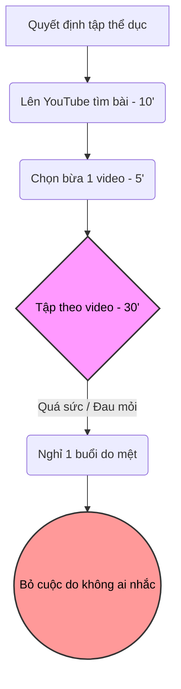
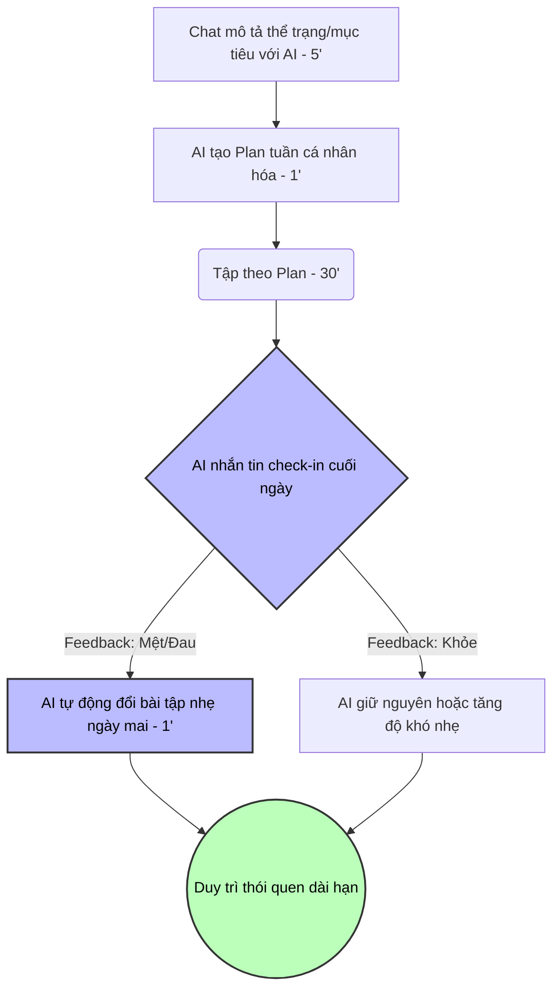

# Workflow Card 1: Cá nhân hóa kế hoạch tập thể dục

## Current State (Hiện tại)

```mermaid
graph TD
    A[Quyết định tập thể dục] --> B(Lên YouTube tìm bài - 10')
    B --> C(Chọn bừa 1 video - 5')
    C --> D{Tập theo video - 30'}
    D -->|Quá sức / Đau mỏi| E(Nghỉ 1 buổi do mệt)
    E --> F((Bỏ cuộc do không ai nhắc))
    
    style D fill:#f9f,stroke:#333,stroke-width:2px,color:#000
    style F fill:#f99,stroke:#333,stroke-width:2px,color:#000
```

## Future State (Tương lai với AI)

```mermaid
graph TD
    A[Chat mô tả thể trạng/mục tiêu với AI - 5'] --> B[AI tạo Plan tuần cá nhân hóa - 1']
    B --> C(Tập theo Plan - 30')
    C --> D{AI nhắn tin check-in cuối ngày}
    D -->|Feedback: Mệt/Đau| E[AI tự động đổi bài tập nhẹ ngày mai - 1']
    D -->|Feedback: Khỏe| F[AI giữ nguyên hoặc tăng độ khó nhẹ]
    E --> G((Duy trì thói quen dài hạn))
    F --> G
    
    style D fill:#bbf,stroke:#333,stroke-width:2px,color:#000
    style E fill:#bbf,stroke:#333,stroke-width:2px,color:#000
    style G fill:#bfb,stroke:#333,stroke-width:2px,color:#000
```
