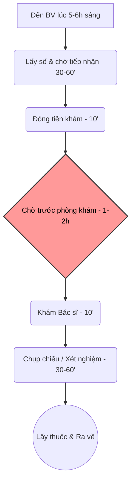
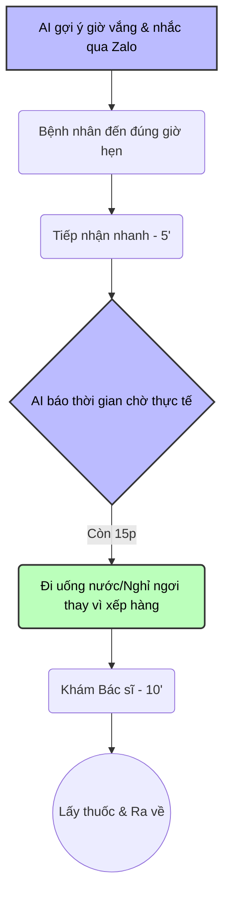

# Workflow Card 2: Dự đoán thời gian chờ khám bệnh viện công

## Current State (Hiện tại)

```mermaid
graph TD
    A[Đến BV lúc 5-6h sáng] --> B(Lấy số & chờ tiếp nhận - 30-60')
    B --> C(Đóng tiền khám - 10')
    C --> D{Chờ trước phòng khám - 1-2h}
    D --> E(Khám Bác sĩ - 10')
    E --> F(Chụp chiếu / Xét nghiệm - 30-60')
    F --> G((Lấy thuốc & Ra về))

    style D fill:#f99,stroke:#333,stroke-width:2px,color:#000
```

## Future State (Tương lai với AI)

```mermaid
graph TD
    A[AI gợi ý giờ vắng & nhắc qua Zalo] --> B(Bệnh nhân đến đúng giờ hẹn)
    B --> C(Tiếp nhận nhanh - 5')
    C --> D{AI báo thời gian chờ thực tế}
    D -->|Còn 15p| E(Đi uống nước/Nghỉ ngơi thay vì xếp hàng)
    E --> F(Khám Bác sĩ - 10')
    F --> G((Lấy thuốc & Ra về))

    style A fill:#bbf,stroke:#333,stroke-width:2px,color:#000
    style D fill:#bbf,stroke:#333,stroke-width:2px,color:#000
    style E fill:#bfb,stroke:#333,stroke-width:2px,color:#000
```
