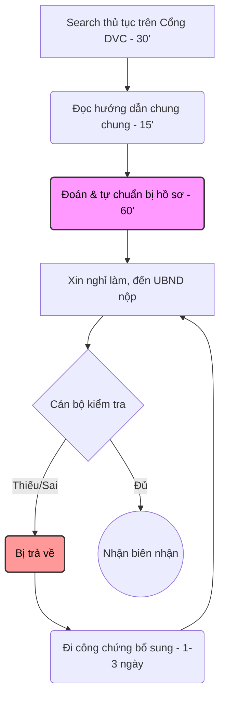
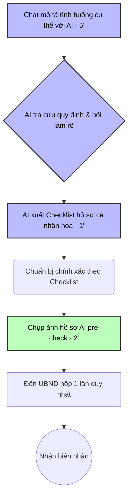

# Workflow Card 3: Chatbot hướng dẫn thủ tục hành chính

## Current State (Hiện tại)

```mermaid
graph TD
    A[Search thủ tục trên Cổng DVC - 30'] --> B(Đọc hướng dẫn chung chung - 15')
    B --> C(Đoán & tự chuẩn bị hồ sơ - 60')
    C --> D[Xin nghỉ làm, đến UBND nộp]
    D --> E{Cán bộ kiểm tra}
    E -->|Thiếu/Sai| F(Bị trả về)
    F --> G(Đi công chứng bổ sung - 1-3 ngày)
    G --> D
    E -->|Đủ| H((Nhận biên nhận))

    style C fill:#f9f,stroke:#333,stroke-width:2px,color:#000
    style F fill:#f99,stroke:#333,stroke-width:2px,color:#000
```

## Future State (Tương lai với AI)

```mermaid
graph TD
    A[Chat mô tả tình huống cụ thể với AI - 5'] --> B{AI tra cứu quy định & hỏi làm rõ}
    B --> C[AI xuất Checklist hồ sơ cá nhân hóa - 1']
    C --> D(Chuẩn bị chính xác theo Checklist)
    D --> E[Chụp ảnh hồ sơ AI pre-check - 2']
    E --> F[Đến UBND nộp 1 lần duy nhất]
    F --> G((Nhận biên nhận))

    style A fill:#bbf,stroke:#333,stroke-width:2px,color:#000
    style B fill:#bbf,stroke:#333,stroke-width:2px,color:#000
    style C fill:#bbf,stroke:#333,stroke-width:2px,color:#000
    style E fill:#bfb,stroke:#333,stroke-width:2px,color:#000
```
